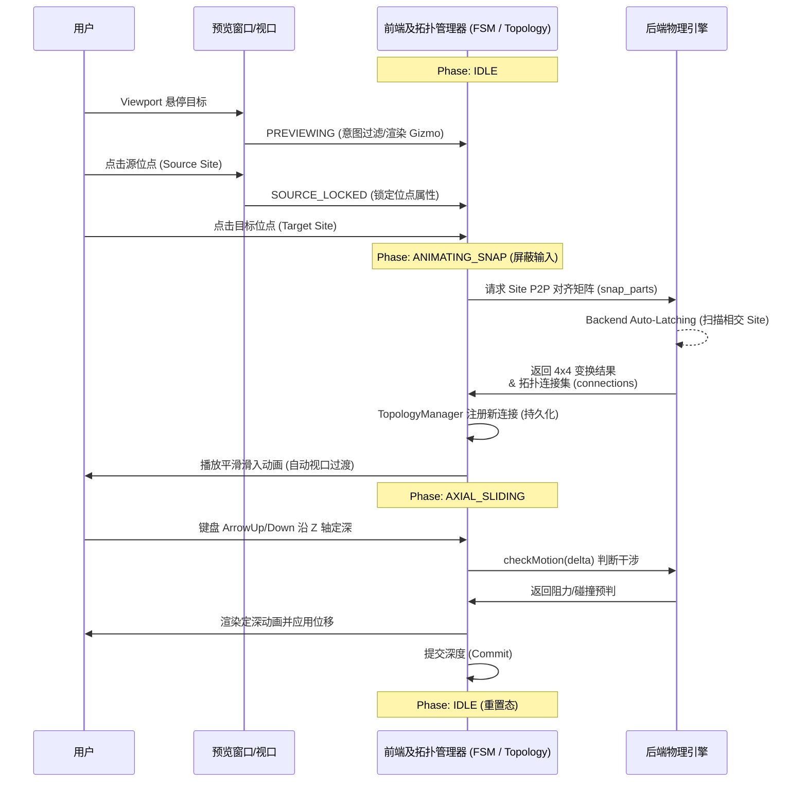

# LEGO CAD 仿真：装配对齐逻辑与算法规范 (v3.1 Site-Based)

## 0. 设计目标 (Design Goal)
确保零件在 3D 空间内的 **“绝对精准落位”**。取消一切基于坐标投影或文件名猜测的模糊逻辑，转向纯粹的 **“锚点驱动 (Anchor-Driven)”** 架构。

---

## 1. 核心算法：Point-to-Point (P2P) 对齐

### **1.1 算法定义**
当源场站 (Source Site) 对齐到目标场站 (Target Site) 时，系统在底层寻找最匹配的语义端口（Port）并执行以下几何约束：
- **轴向对冲 (Anti-Parallel)**: `Z_source = -Z_target` (强制 Z 轴反向平行)。
- **中心重合 (Coincident)**: `Position_source = Position_target` (中心点欧几里得距离为 0)。
- **单一自由度初始化**: 对齐后的位姿作为 **Base Pose**，仅保留沿 Z 轴的一维平移自由度。

### **1.2 为什么交互发生在 Site 层面？**
- **歧义消解**: 许多零件（如十字孔+圆孔的组合）在物理空间同中心。Site 作为空间分组，在交互时提供单一的点击靶点，并在底层自动匹配最合适的 Port (如 Axle 找 AxleHole)。
- **允许后续滑动 (Axial Sliding)**: 具有严密的数学运动轴心。

---

## 2. 交互操作序列 (Interaction Sequence)

---

## 3. 业务规则 (Business Rules)

1.  **P2P 强制执行**: 禁止使用轴向投影。所有 Snap 动作落位点偏移必须小于 `1e-6`。
2.  **深度滑动 (Sliding Rule)**: 落位后产生的一维位移存入 `ConnectionEdge.depthOffset` 字段，不改变零件局部模型，只改变拓扑相对偏移。
3.  **自由度自感应 (DOF Sensing)**:
    - 依据 Site 的截面形状 (Circle/Cross) 自动产生物理 Joint。
    - 当出现多根轴平行连接时，系统自动锁定绕轴旋转自由度。
4.  **视口自动对齐 (Auto-Frame)**: 每一个 Snap 动作完成后，相机焦点自动向目标 Site 平滑过渡，消除微观交互时的虚晃。

---

## 4. 拓扑森林与多孤岛管理 (Topological Forests & Isolated Islands)

与传统软件维护一个单一树 (Single Tree) 结构不同，本系统的数据流维护的是一个基于 `ConnectionGraph` 的**无向图连通分量 (Connected Components) 集合**。这构成了支持多模块独立拼搭的核心基石：
1. **多组共存**: 用户可以在世界坐标系中丢入无限量的新地基零件。每一个完全独立的零件或相互连通的组（Group），在状态机中被称为一个“孤岛 (Island)”或“连通分量”。
2. **并行互不干扰**: 无论是点击选中 (BFS/DFS 查找)、整体平移还是删除运算，算法的寻径边界严格止步于相连接的 `ConnectionEdge`。因此，对一个孤岛的任何物理/逻辑计算绝不会传染或污染另一个孤岛。
3. **Bottom-Up 自由重组**: 当用户在右边搭完底盘，左边搭完起重臂，此时通过 `Snap` 动作将起重臂上的轴孔对准底盘的轴插入。后端的 Auto-Latching 引擎会瞬间计算合并，前端的拓扑图记录下这条新的边，两个原本独立的连通分量（图网络）就立刻融合成为了同一个大 Group。

---

## 5. 几何端口语义与拓扑生成规则 (Port Topology Rules)

为保证 P2P 的准确切面贴合与带凸缘（Flange）零件的防穿模交互，底层几何解析器 (`GeometryProcessor`) 对 LDraw 原件的提取执行以下**绝对空间对齐与分裂规范**：

1. **贯通孔双面分裂 (Through-hole Split)**:
   对于 `beamhole`, `connhole`, `crosshole` 等定义为 `1 Lego Unit (20 LDU)` 标准厚度的离散通孔，**不得提取原点作为单一端口**。系统必须在孔的正反两侧切面（距中心偏置 `±10 LDU`）强制产生两个法向严格相反、位置对称的“表面端口”。这样做的目的是提供真实的物理切面阻隔点，使 UI 射线能捕捉前后插入意图。
2. **单侧盲孔锚定 (Blind-hole Surface Anchoring)**:
   对于 `peghole` 等底部不连通的单端盲孔，直接在模型定义的接触面原点提取单一向外法向的端口，**严禁双向分裂**以防在实体内部生成无法拾取的幽灵连接腔。
3. **连续多位点组件空间偏置补偿 (Continuous Array Centering)**:
   对于长轴 (`axle.dat`)、深孔管 (`axlehol8.dat`) 等长度大于一步进单位的连续延伸组件，禁止简单从边缘累加步长。必须以结构的全局几何域中心归一化（如 `local_y = 0.5`），再配合居中对称分布等式 `(k - N/2 + 0.5) * 20 LDU`，以抵消端部非标准倒角误差。从而保证阵列提取的端口在绝对空间完美座落于每个标准单元格的“功能中心”。

---

## 6. 刚体子组旋转的锚点排除算法 (Group Rotation around Anchor)

### **6.1 设计动因**
键盘 `[` / `]` 触发的 90° 步进旋转 (USER_MANUAL §3) 不能简单实现为"动一个零件"或"动整个连通分量"，否则违反 spec：
- **仅动一个零件** → 灰板上插了销、销又被点为 source 时，销飞走，灰板留原地，几何与连接图撕裂。
- **动整个连通分量** → 灰板和它对面的红板（通过销相连）一起转，违反 Case 3.4「地基锁定：底板像大地一样稳固不动，成为所有相对运动的绝对参考系」。

正确语义：**以 `selectedPort` 处对面的 peer 作锚点**，从 source 出发、不穿越 peer 的 BFS 子图作为旋转域，整体绕 `selectedPort` 的 Z 轴旋转。

### **6.2 算法步骤**
输入：`selectedPort`（含 partId、局部 position、局部 rotation Mat3）、`angleRads`。

1. **新位姿计算**：以 `selectedPort` 局部 Z 轴为转轴，调用 `calculatePortRotationPose` 求 source 部件的世界新位姿 `newPose`。

2. **锚点 peer 判定**（按优先级）：
   - **(a) AXIAL_SLIDING 阶段**：`slidingTarget.partId` 是显式的对面，直接作 `excludeId`。
   - **(b) SOURCE_LOCKED 阶段**：在 `occupiedPorts[partId]` 中做**对偶面容差查询**——找位置距 `selectedPort.position` 在 `TOL = 0.02 LDU` 内、且 Z 法线同轴（`|dot(n_sel, n_occ)| ≈ 1`，容忍 0.05）的占用项；该项的 value（即 peer partId）作 `excludeId`。
   - **(c) 既无 slidingTarget 也无对偶面 peer**：`excludeId = ""`，BFS 不排除任何节点。

3. **子组 BFS**：`srcGroup = getConnectedGroup(connections, partId, excludeId)`——从 source 起广度优先，遇到 `excludeId` 不展开。

4. **过约束检测 (Case 4.1，one-hop closure 测试)**：合法旋转域定义为 `{source} ∪ source 的直接邻居`（即 source + "挂在它身上的"挂件销/附件）。检查 `srcGroup ⊆ 合法域`；若有溢出（即 srcGroup 包含 source 的二阶或更远邻居），说明 source 通过某个邻居二阶串联到了独立物体——几何上锁死，旋转被拒绝并以 ERROR 级 log 列出溢出零件，提示用户删除多余连接或换端口作 anchor。

   _算法选型对比_：
   - **v3 (邻居漏出)**：只看 `connections[anchor]` 是否漏到 srcGroup，漏检"anchor 是叶子但 source 通过别的销连对面"。
   - **v4 (cut vertex)**：图论严格但把 degree=1 的"叶子 anchor"误判为过约束（叶子节点去掉后 component 数不变，cut vertex 定义不成立）。
   - **v5 (one-hop closure，当前实现)**：以"source 的一阶邻接闭包"作为合法域，既精确覆盖 Case 4.1 多并联场景，也正确放行"叶子 anchor + 简单挂件"的合法旋转。

5. **刚体 delta 应用**：以 `(part.oldPose, newPose)` 构造刚体变换 `delta = T_new × T_old⁻¹`；通过 `applyGroupDelta` 把 `delta` 施加给 `srcGroup` 内每个零件，得 `groupNewPoses`。

6. **批量写回**：`batchUpdatePartStates(groupNewPoses)`。

### **6.3 为什么需要"对偶面容差查询"**
§5.1「贯通孔双面分裂」规定：每个 `connhole` 在元数据里强制提取**两个法向严格相反、位置对称**的端口对象。snap 时占用图记录的是"销实际对接的那一面"的 portKey，但用户旋转时点击的可能是孔的**对偶面**——若用 `portKey` 严格 hash 查询，命中不上。

容差查询通过比较"位置接近 + 法线同轴"在查询层面把双面端口归一为同一物理槽位，无需修改 portKey 的写入语义（避免污染占用渲染、撤销栈等其他依赖路径）。

### **6.4 示例对照表**

| 场景 | source | peer (锚点) | srcGroup | 视觉效果 |
|---|---|---|---|---|
| 销已插灰板，点销另一端转 | 销 | 红板 (销→红板边) | {销, 灰板, 灰板上其他附件} | 销带灰板一起飞，红板纹丝不动 |
| 灰板某孔接销→红板，点灰板该孔转 | 灰板 | 销 | {灰板} (销和红板都不在) | 灰板自转，销和红板纹丝不动 |
| source 是孤岛（未连任何东西） | 任意 | 无 | {source 自己 + 已挂附件} | 整体旋转，不影响其他孤岛 |

### **6.5 已知遗漏 (Open Items)**
1. ~~**AutoLatch 边集未回流前端**~~ — **[已修复 ✅]**：`/api/snap_parts` 响应新增 `auto_latched_edges` 字段携带每条 AutoLatch 闭合边的 `(src_part_id, dst_part_id, src_port_key, dst_port_key)`。前端在 axios.then 回调里幂等并入 `connections` / `occupiedPorts`，并在 `snapPreState` 仍在场时追加到其 `addedConnections` / `addedPortKeys`，使 SnapCommand 的 undo 能整体回滚。详见 Issue Reports §3 第 1 条。**对当前算法的直接影响**：§6.2 第 2 步的"对偶面容差查询"现在能在 AutoLatch 闭合的端口上正确命中 peer，§6.4 表格中"销已插灰板"行的 srcGroup 推断不再因 AutoLatch 边缺失而退化为 anchor=none 整组旋转。
2. **TOL 阈值脆弱性**：`0.02 LDU` 是单点观察的硬编码常量，对孔距 < 0.04 的更紧凑零件可能误匹配相邻孔。根治方案是把 `ConnectionEdge` 升级为带端口标签的有向边 `{ srcPortKey, dstPortKey }`，peer 查询直接 O(1) 准确，无需浮点容差——但这是涉及 snap、AutoLatch、persist schema 的架构级改动。
3. **过约束的 UX 优化**：当前过约束触发时仅输出 ERROR log，UI 上没有"锁死图标"或浮动提示（spec Case 4.1 要求显示锁死图标）。功能正确但可发现性差。
