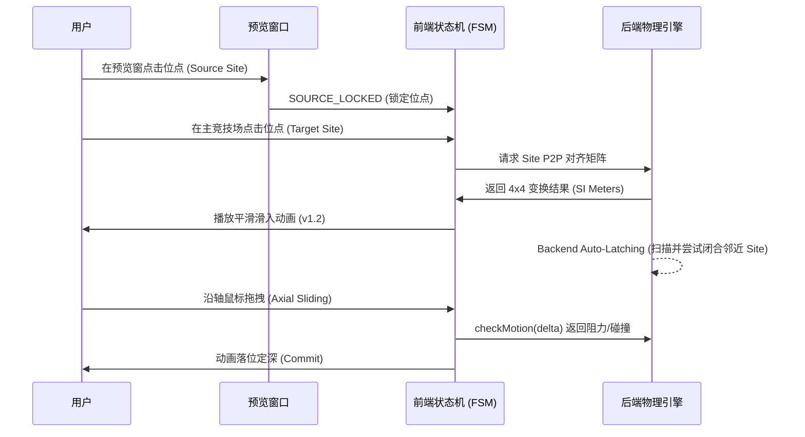

# LEGO CAD 仿真：装配对齐逻辑与算法规范 (v3.1 Site-Based)

## 0. 设计目标 (Design Goal)
确保零件在 3D 空间内的 **“绝对精准落位”**。取消一切基于坐标投影或文件名猜测的模糊逻辑，转向纯粹的 **“锚点驱动 (Anchor-Driven)”** 架构。

---

## 1. 核心算法：Point-to-Point (P2P) 对齐

### **1.1 算法定义**
当源场站 (Source Site) 对齐到目标场站 (Target Site) 时，系统在底层寻找最匹配的语义端口（Port）并执行以下几何约束：
- **轴向对冲 (Anti-Parallel)**: `Z_source = -Z_target` (强制 Z 轴反向平行)。
- **中心重合 (Coincident)**: `Position_source = Position_target` (中心点欧几里得距离为 0)。
- **单一自由度初始化**: 对齐后的位姿作为 **Base Pose**，仅保留沿 Z 轴的一维平移自由度。

### **1.2 为什么交互发生在 Site 层面？**
- **歧义消解**: 许多零件（如十字孔+圆孔的组合）在物理空间同中心。Site 作为空间分组，在交互时提供单一的点击靶点，并在底层自动匹配最合适的 Port (如 Axle 找 AxleHole)。
- **允许后续滑动 (Axial Sliding)**: 具有严密的数学运动轴心。

---

## 2. 交互操作序列 (Interaction Sequence)

---

## 3. 业务规则 (Business Rules)

1.  **P2P 强制执行**: 禁止使用轴向投影。所有 Snap 动作落位点偏移必须小于 `1e-6`。
2.  **深度滑动 (Sliding Rule)**: 落位后产生的一维位移存入 `ConnectionEdge.depthOffset` 字段，不改变零件局部模型，只改变拓扑相对偏移。
3.  **自由度自感应 (DOF Sensing)**:
    - 依据 Site 的截面形状 (Circle/Cross) 自动产生物理 Joint。
    - 当出现多根轴平行连接时，系统自动锁定绕轴旋转自由度。
4.  **视口自动对齐 (Auto-Frame)**: 每一个 Snap 动作完成后，相机焦点自动向目标 Site 平滑过渡，消除微观交互时的虚晃。
