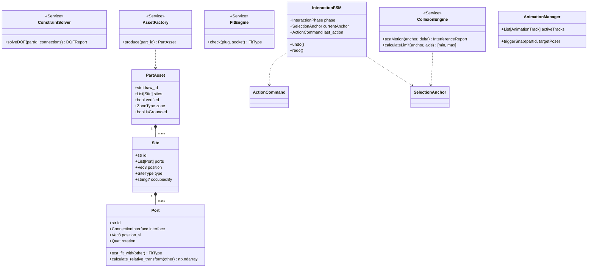

# LEGO CAD 仿真：面向对象类图设计与 SRP 规范 (v3.1 Site-Based)

## 0. 前言：单一责任原则 (The SRP Philosophy)
本项目严格遵守单一责任原则。每一个类、每一个接口都必须有且只有一个“改变的理由”。

---

## 1. 全栈核心类图 (Full System Class Diagram)

---

## 2. 核心大类职能与接口契约 (SRP & API)

### **2.1 物理计算类 (Compute Services)**
- **`ConstraintSolver`**: 负责自由度解析。
    - `solveDOF()`: 根据连接图动态推导零件是否可旋转 (`canRotate`) 或滑动 (`canSlide`)。
- **`FitEngine`**: 负责截面语义判定。
    - `check()`: 根据 `Profile` (圆/十字) 和内径公差计算 `FitType`。
- **`CollisionEngine`**: 负责几何干涉计算。
    - `testMotion()`: 实时检测移动路径上是否撞击 (`InterferenceReport`)。

### **2.2 仿真实体类 (Simulation Entities)**
- **`Port`**: 强制 **+Z 轴** 为插入法线。
- **`Site`**: 管理物理坑位。负责解决同心孔选择冲突。
- **`PartAsset`**: 包含 `isGrounded` (地基锚定) 属性。

---

## 3. 辅助数据结构与协议 (Data Structures & Protocols)

### **3.1 运动与动画契约**
- **`AnimationTrack`**: 描述 `Pose` (Position + Quat) 随时间的补间轨道。包含 `duration`, `easing`, `onComplete`。
- **`DOFReport`**: 包含活动轴线、步进角度 (`angleStep`) 和允许滑动区间 (`slideRange`)。

### **3.2 选择与交互契约**
- **`SelectionAnchor`**: 定义“点谁谁走”的重心。包含 `primaryId`, `allConnectedIds` (物理连通组) 和 `level` (GROUP / INDIVIDUAL)。
- **`InterferenceReport`**: 包含 `isBlocked`, `contactPoints` (干涉高亮点) 以及拦截原因。

---

## 4. 枚举与语义地图 (Enums)

### **4.1 核心状态枚举**
- **`InteractionPhase`**: `IDLE`, `PREVIEWING`, `SOURCE_LOCKED`, `AXIAL_SLIDING`, `ANIMATING`。
- **`FitType`**: `CLEARANCE` (间隙), `FRICTION` (摩擦), `BLOCKED` (干涉)。
- **`ZoneType`**: `ACTIVE_ARENA`, `STAGED`, `PREVIEW`。

---

## 5. 设计约束 (Design Contracts)

1.  **零隐式猜测**: 禁止在业务代码中使用字符串匹配，必须依赖 `ConstraintSolver` 和 `FitEngine`。
2.  **强制归一化**: 所有的输入数据必须通过 `CoordinateTransformer` 转换为 **SI 米制 Y-Up 归一化位姿**。
3.  **单一真理来源**: 场景状态必须由 `InteractionFSM` 驱动，物理有效性由 `CollisionEngine` 实时哨卫。
4.  **撤销路径**: 只有在 `MouseUp` 或 `Commit` 后记录最终位姿变更到历史栈。
