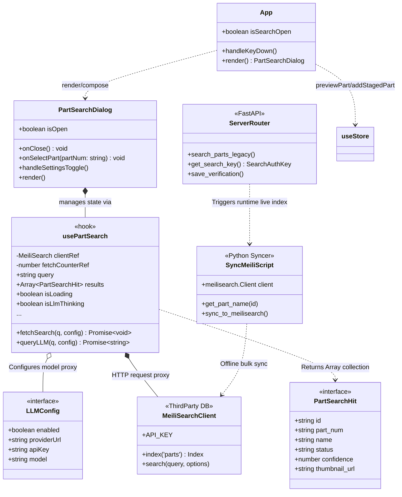

# AI 查询类结构解析图 (System Class Diagram)

本文档运用 Mermaid classDiagram 描绘了前端 React 的检索代理组件与外部 MeiliSearch 检索引擎服务间的结构依赖关系，展现了组件单一职责（Single Responsibility）及其内部的数据挂载情况。

## 类职能补充描述 (Class Responsibilities)
1. **App**: 全局根节点（Root），接管全局快捷键（如 `Cmd+K`），维持单例的悬浮窗开启态，同时衔接底层 `Zustand store`（比如检索完成后的3D透视反馈 `previewPart`）。
2. **PartSearchDialog (UI 层)**: 纯表象渲染。剥离了业务搜索请求机制。左区负责展示配置表单，并从 `localStorage` 回放；右区基于 `Zustand / hook` 返回的 `results` 进行瀑布流渲染。
3. **usePartSearch (业务与代理通信层)**: 作为防抖管控器，屏蔽前端极高频（每敲击一次字母）给深求大模型或 Meili 引擎造成的攻击负载，利用并发计数器（`currentCounter !== fetchCounterRef`）斩断过期的请求幽灵（Race Condition Cancellation）。
4. **ServerRouter (安全性层)**: `get_search_key` 仅下发受限（Limited只读）的 `search` Token 供前端 `clientRef` 连接，确保即便纯前端方案也杜绝数据库被删库。
