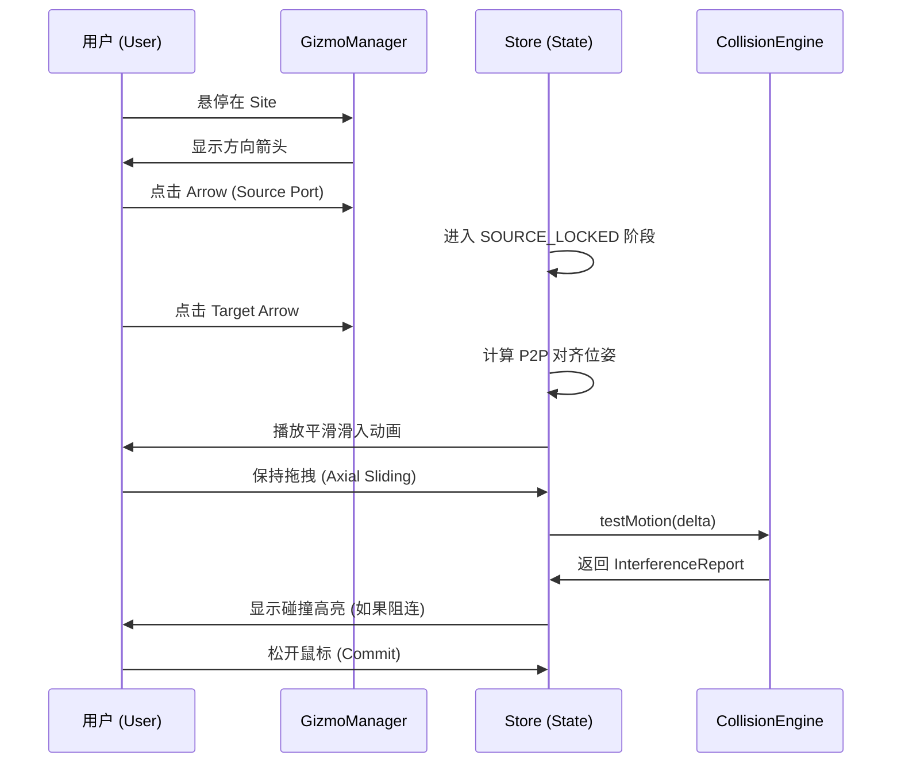

# 装配体层级设计文档 v1.2 — 锚点驱动、拓扑感知与精准落位

> **To Claude Code CLI:**
> Please read the following context files immediately:
> - `frontend/src/store.ts` (Frontend state machine)
> - `topology_manager.py` (TopologyManager & PartNode)
> - `docs/technical/v1_2_class_interface_spec.md` (Interface Contract)

---

## 1. 核心设计原则 (Interaction v1.2 Core)

为了解决零件翻转 Bug 并提升机械装配精度，本系统已全面转向 **“锚点驱动 (Anchor-Driven)”** 架构。

### 1.1 精准落位：由 `stripAxis` 转向 `Point-to-Point`
- **旧逻辑 (已废弃)**：`stripAxis`。通过将端口投影到轴心线来对齐。**缺陷**：导致轴向信息丢失，产生深度偏置和镜像反转。
- **新逻辑 (v1.2)**：**Point-to-Point (P2P)**。
  - **规则**：强制源端口 Z 轴与目标端口 Z 轴反向平行，中心点坐标重合。
  - **优势**：消除了所有几何歧义，为后续的“沿轴滑动调节深度”提供了干净的初始状态。

### 1.2 交互重心：锚点模式 (Anchor Mode)
- **规则**：用户点击的第一个零件被定义为 **Selection Anchor (操作锚点)**。
- **逻辑**：移动、旋转、滑动的所有数学变换均围绕 Anchor 展开。

---

## 2. 核心类定义与职责 (Class Hierarchy)

### 2.1 `Site` (物理场站)
- **职责**：管理物理意义上的孔位/位点。
- **包含**：多个 `Port` 对象。解决同心圆孔与十字孔的选择冲突。

### 2.2 `Port` (交互端口)
- **职责**：标准化的连接意图点。
- **约束**：**Z 轴必为插入方向法线**。

### 2.3 `ConnectionEdge` (拓扑边)
- **职责**：存储两个 Part 之间的拓扑连接。
- **状态**：包含 `depthOffset` (沿轴深度) 和 `rotationOffset` (绕轴旋转)。

### 2.4 `TopologyManager` (拓扑管理器)
- **职责**：维护全场景的图形结构 (Multi-DiGraph)。
- **算法**：实时扫描物理闭环 (Loop Detection) 与自由度解析 (DOF Solving)。

---

## 3. 设计规则 (Design Rules - v1.2 修正版)

1. **落位必准 (P2P Rule)**：禁止使用任何形式的轴向投影。所有 Snap 必须实现 3D 空间内的点对点、法向反向对齐。
2. **深度滑动 (Sliding Rule)**：Snap 完成后的位置仅作为 **Base Pose**，用户通过手势滑动产生的位移记录在 `ConnectionEdge.depthOffset` 中。
3. **锚点优先 (Anchor Selection)**：单击选中锚点零件，默认带动整个连通子装配体；`Ctrl` 点击执行解耦选择。
4. **自由度自动感应 (DOF Sensing)**：
   - 核心规则：根据孔位截面形状（Circle vs Cross）自动推导旋转限制。
   - 多点并行约束：如果多根轴平行，禁用旋转 UI，限位滑动。
5. **视口自动对齐 (Auto-Frame)**：选中零件后，相机焦点自动向选中的 Site 中心靠拢，提升微操体验。

---

## 4. 禁忌约束 (Negative Constraints)

- **严禁** 在零件配置文件中使用非标准的坐标轴定义。
- **严禁** 允许用户在物理锁死（Over-constrained）的方向上进行非法强制位移。
- **严禁** 在主画布（Active Arena）与暂存区（Staging Tray）零件之间建立逻辑连接。
- **严禁** 在 Snap 算法中引入任何基于零件名称的 “if-else” 猜测逻辑。

---

## 5. 交互序列 (Interaction Sequence)

