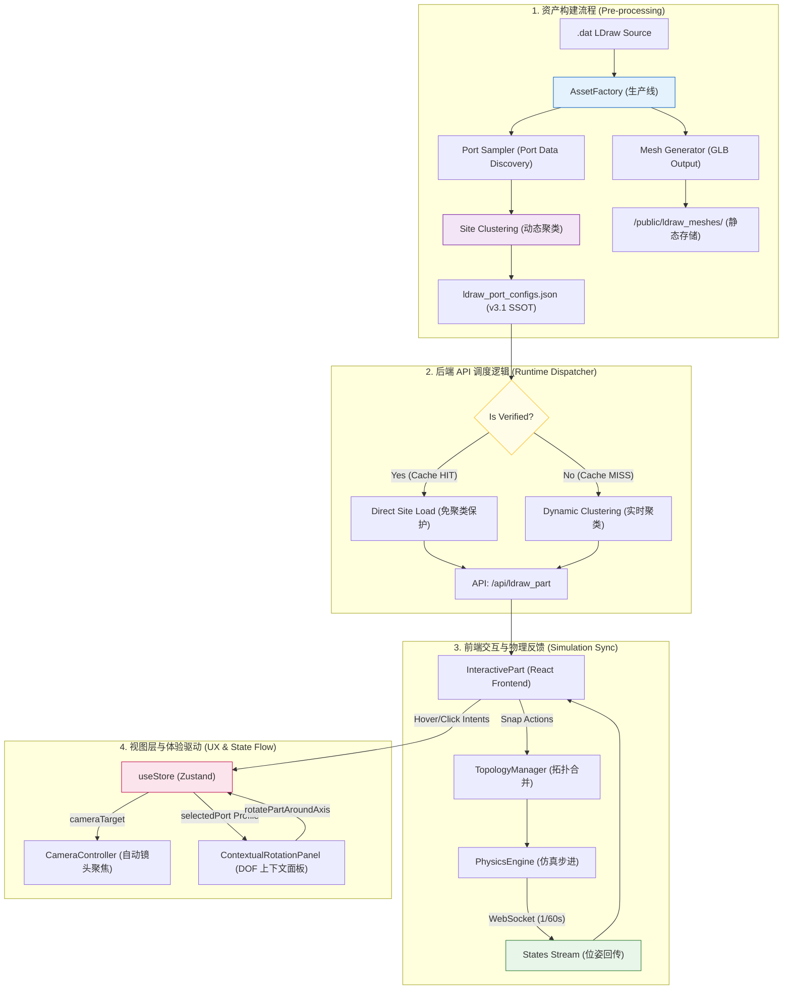

# LEGO CAD 仿真：全栈归一化数据流架构 (v3.0)

## 0. 核心空间协议 (Spatial Convention)

数据流的基础公约：
-   **单位**: SI 米 (Meters)。
-   **坐标系**: Y-Up (右手系)。
-   **换算**: `Rx(180) @ LDU * 0.0004`。

---

## 1. 全生命周期数据流图 (The Data Flow Diagram)



---

## 2. 关键管线节点定义

### **2.1 第一阶段：离线资产加工 (Asset Factory Stage)**
-   **核心工具**: `scripts/bake_assets.py` (统一资产烘培流水线)。
-   **关键算子**:
    1.  **矩阵提纯 (Purification)**: 消除嵌套浮点误差。
    2.  **空间归一化**: 执行 Rx180 翻转。
    3.  **Site 聚类 (Clustering)**: 执行 `site_utils.py` 中的近邻贪心聚类算法，将距离 < 0.1mm 的端口归并为 Site。
    4.  **色彩着色 (Color Baking)**: 基于 `LDConfig.ldr` 将传入的 `color_code` 编码解析为 RGB/Alpha，注入到 GLB 文件的 `vertex_colors` (对于基础图元) 或者独立材质节点，通过 `hasVertexColors` 被前端的三维管线接管使用。作为 ABS Plastic 反馈给后续 PBR 管线。
-   **主要产出**: 同步写入按 `"{part_id}_c{color_code}.glb"` 规则隔离换色缓存的 **`.glb`** 文件与 **`ldraw_port_configs.json`** (v3.1 Sites 模式)。

### **2.2 第二阶段：运行时 API 服务 (API Dispatch Stage)**
-   **核心原则：保护人工由于误差**
-   **逻辑分支**：
    -   **已校验 (Verified)**: 直接读取 `sites` 数组，跳过聚类。这是为了防止重新聚类可能导致的人工微调数据偏移。
    -   **未校验 (Pending)**: 调用 `site_utils.py` 进行实时聚类，以便在交互界面中提供基础的可视化位点。

### **2.3 第三阶段：物理同步流 (State Sync Stage)**
-   **协议**: WebSocket (`/ws/physics_stream`)。
-   **频率**: 60Hz。
-   **内容**: 包含所有 Link 的位姿矩阵及其物理状态（如线速度、角速度）。

### **2.4 第四阶段：视图层与体验驱动 (UX State Flow)**
-   **全局状态机 (`useStore`)**: 作为交互层与逻辑层的唯一总线。接收来自 `InteractivePart` / `SiteGizmo` 的点击事件，计算目标 `cameraTarget` 坐标。
-   **镜头自动对齐 (Auto-Frame)**: `CameraController` 订阅 `cameraTarget` 数据流，一旦发生变化即执行平滑的补间动画，实现镜头跟随。
-   **上下文面板 (Rotation Panel)**: 面板组件订阅当前激活的 `selectedPort` 状态。它首先评估端口语义（比如判断 `Profile` 是否是 `CYLINDER` 允许旋转），继而按需挂载渲染 3D 控件，并将用户的步进指令派发回状态机。

---

## 4. 资产数据结构规范 (Asset Data Schema v3.1)

所有通过烘焙管线的零件在 `ldraw_port_configs.json` 中遵循以下 **“Site-Based 资产包”** 规范：

```json
{
  "part_id.dat": {
    "version": "v3.1.sites",
    "baked_at": "YYYY-MM-DD HH:MM:SS",
    "glb_path": "data/custom_assets/part_id.glb",
    "status": "verified",
    "sites": [
      {
        "id": "string (part_id_siteN)",
        "position": [number, number, number], // SI Meters (Y-Up)
        "ports": [
          {
            "name": "string (unique_id)",
            "type": "string (primitive_name)",
            "position": [number, number, number],
            "rotation": [[number,3], [number,3], [number,3]],
            "is_manually_adjusted": boolean
          }
        ]
      }
    ]
  }
}
```

---

## 5. 防御与监控 (防御管线)

-   **视觉漂移卫兵**: 测试脚本定时检查模型网格与 JSON 坐标的小数点 6 位一致性。
-   **全库重刷契约**: 修改归一化内核逻辑后，必须强制清理 `/public/ldraw_meshes` 并重跑全量脚本。

---

## 6. /api/snap_parts 响应契约

POST `/api/snap_parts` 在登记主连接后会触发 AutoLatchScanner 扫描相邻 Site，
扫到的额外边通过响应回流给前端。请求体 schema 见 `backend/server.py::SnapRequest`；
响应体形状如下：

```jsonc
{
  "status": "success",
  "msg": "Connected <parent_id> to <child_id>",
  "auto_latched_count": 2,
  "auto_latched_edges": [
    {
      "src_part_id": "beam_a",
      "dst_part_id": "beam_b",
      // portKey 字符串：与前端 store.ts::portKey() 输出逐字符一致。
      // 由 backend/auto_latch_scanner.py::serialize_port_key() 产出，
      // 包含位置 toFixed(4)、Z 法线 toFixed(2)、负零归一化。
      "src_port_key": "0.0000,0.0400,0.0000|0.00,0.00,1.00",
      "dst_port_key": "0.0000,-0.0400,0.0000|0.00,0.00,-1.00"
    }
  ]
}
```

### 字段语义

-   `auto_latched_count`：AutoLatch 实际登记到拓扑图的边数（计数，便于日志打印）。
-   `auto_latched_edges`：每条 AutoLatch 闭合边的"前端可消费"摘要。前端必须按此把
    每条边幂等地写入 `connections`（双向 add）与 `occupiedPorts[partId][portKey]`，
    使后续旋转锚点查询、SiteGizmo 占用渲染、级联清理都能命中。
-   即使 `auto_latched_count == 0`，`auto_latched_edges` 也保证存在为 `[]`，
    使前端解构稳定、不需做存在性判断。

### 前端消费契约

-   写入 `connections` / `occupiedPorts` 前必须做幂等检查（主连接已写入相同端口键的
    场景下不可重复追加），见 `frontend/src/store.ts::snapParts` 的 axios.then 回调。
-   若 `snapPreState` 此时仍在场（commitAxialSliding 尚未触发），AutoLatch 边的
    `addedConnections` / `addedPortKeys` 应追加到 `snapPreState`，确保 SnapCommand 的
    undo 能整体回滚（含 AutoLatch 闭合的对扣边）。

### portKey 一致性

`serialize_port_key()` 与 `portKey()` 必须严格同源——位置 4 位小数、Z 法线 2 位小数、
负零归一化。若两端格式漂移，前端的 occupiedPorts 查询会全面命中失败，连带破坏
旋转锚点判定（详见 `docs/02_system_design/01_assembly_logic_and_algorithms.md` §6）。
覆盖测试见 `backend/tests/test_auto_latch_scanner.py::TestSerializePortKey`。
