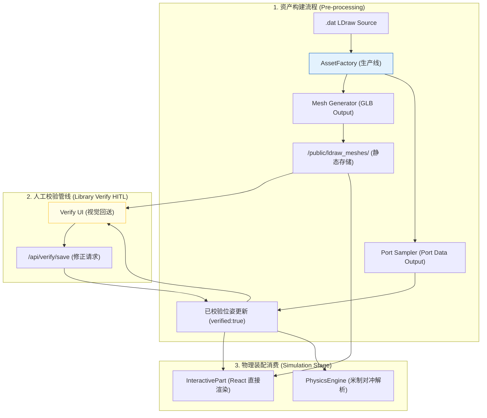

# LEGO CAD 仿真：全栈归一化数据流架构 (v3.0)

## 0. 核心空间协议 (Spatial Convention)

数据流的基础公约：
-   **单位**: SI 米 (Meters)。
-   **坐标系**: Y-Up (右手系)。
-   **换算**: `Rx(180) @ LDU * 0.0004`。

---

## 1. 全生命周期数据流图 (The Data Flow Diagram)



---

## 2. 关键管线节点定义

### **2.1 第一阶段：离线资产加工 (Asset Factory Stage)**
-   **核心工具**: `scripts/bake_assets.py` (统一资产烘培流水线)。
-   **关键算子**:
    1.  **矩阵提纯 (Purification)**: 消除嵌套浮点误差。
    2.  **空间归一化**: 执行 Rx180 翻转。
    3.  **步长采样 (Pitch Sampling)**: 在长插销 (2L, 3L) 路径上按照 8mm (20 LDU) 间距均匀采样。
-   **主要产出**: 同步写入 **`.glb`** 文件与 **`ldraw_port_configs.json`**。

### **2.2 第二阶段：人工校验质量关 (Quality Control - HITL)**
-   **责任**: 识别不可自动化的轴向误差。

---

## 4. 资产数据结构规范 (Asset Data Schema v3.0)

所有通过烘焙管线的零件在 `ldraw_port_configs.json` 中遵循以下 **“原子资产包”** 规范：

```json
{
  "part_id.dat": {
    "version": "v3.0.normalized",
    "baked_at": "YYYY-MM-DD HH:MM:SS",
    "glb_path": "data/custom_assets/part_id.glb",
    "verified": false,
    "ports": [
      {
        "name": "string (unique_id)",
        "type": "string (primitive_name)",
        "position": [number, number, number], // SI Meters (Y-Up)
        "rotation": [[number,3], [number,3], [number,3]] // SO(3) Orthogonal Matrix
      }
    ]
  }
}
```

---

## 5. 防御与监控 (防御管线)

-   **视觉漂移卫兵**: 测试脚本定时检查模型网格与 JSON 坐标的小数点 6 位一致性。
-   **全库重刷契约**: 修改归一化内核逻辑后，必须强制清理 `/public/ldraw_meshes` 并重跑全量脚本。
