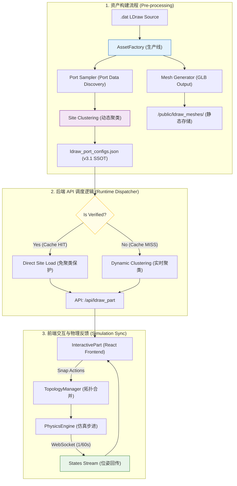

# LEGO CAD 仿真：全栈归一化数据流架构 (v3.0)

## 0. 核心空间协议 (Spatial Convention)

数据流的基础公约：
-   **单位**: SI 米 (Meters)。
-   **坐标系**: Y-Up (右手系)。
-   **换算**: `Rx(180) @ LDU * 0.0004`。

---

## 1. 全生命周期数据流图 (The Data Flow Diagram)



---

## 2. 关键管线节点定义

### **2.1 第一阶段：离线资产加工 (Asset Factory Stage)**
-   **核心工具**: `scripts/bake_assets.py` (统一资产烘培流水线)。
-   **关键算子**:
    1.  **矩阵提纯 (Purification)**: 消除嵌套浮点误差。
    2.  **空间归一化**: 执行 Rx180 翻转。
    3.  **Site 聚类 (Clustering)**: 执行 `site_utils.py` 中的近邻贪心聚类算法，将距离 < 0.1mm 的端口归并为 Site。
-   **主要产出**: 同步写入 **`.glb`** 文件与 **`ldraw_port_configs.json`** (v3.1 Sites 模式)。

### **2.2 第二阶段：运行时 API 服务 (API Dispatch Stage)**
-   **核心原则：保护人工由于误差**
-   **逻辑分支**：
    -   **已校验 (Verified)**: 直接读取 `sites` 数组，跳过聚类。这是为了防止重新聚类可能导致的人工微调数据偏移。
    -   **未校验 (Pending)**: 调用 `site_utils.py` 进行实时聚类，以便在交互界面中提供基础的可视化位点。

### **2.3 第三阶段：物理同步流 (State Sync Stage)**
-   **协议**: WebSocket (`/ws/physics_stream`)。
-   **频率**: 60Hz。
-   **内容**: 包含所有 Link 的位姿矩阵及其物理状态（如线速度、角速度）。

---

## 4. 资产数据结构规范 (Asset Data Schema v3.1)

所有通过烘焙管线的零件在 `ldraw_port_configs.json` 中遵循以下 **“Site-Based 资产包”** 规范：

```json
{
  "part_id.dat": {
    "version": "v3.1.sites",
    "baked_at": "YYYY-MM-DD HH:MM:SS",
    "glb_path": "data/custom_assets/part_id.glb",
    "status": "verified",
    "sites": [
      {
        "id": "string (part_id_siteN)",
        "position": [number, number, number], // SI Meters (Y-Up)
        "ports": [
          {
            "name": "string (unique_id)",
            "type": "string (primitive_name)",
            "position": [number, number, number],
            "rotation": [[number,3], [number,3], [number,3]],
            "is_manually_adjusted": boolean
          }
        ]
      }
    ]
  }
}
```

---

## 5. 防御与监控 (防御管线)

-   **视觉漂移卫兵**: 测试脚本定时检查模型网格与 JSON 坐标的小数点 6 位一致性。
-   **全库重刷契约**: 修改归一化内核逻辑后，必须强制清理 `/public/ldraw_meshes` 并重跑全量脚本。
