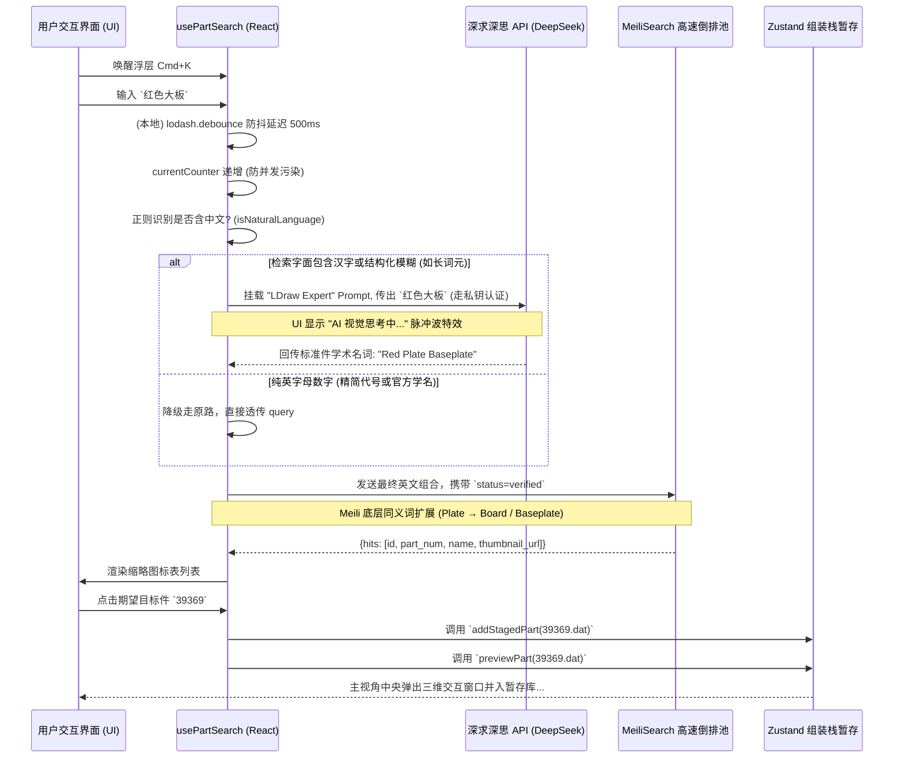

# UI 交互查询与 LLM 扩写引擎数据链路流向图 (Data Flow)

本文档旨在直观刻画乐高组件检索链路的流转，该过程重点突出了由于“模糊自然语言”参与所导致的大模型中介入（Proxy）路由。

## 实时检索流 (Real-time Search Data Flow)



## 数据池异步清洗入库流 (ETL Offline Syncer)

离线索引库依靠后端的清洗程序将杂乱的 LDraw `.dat` 解析为文档存储形式，并附加上 `Verified` 审核属性，确保未完成骨架标记的破损件不会流向全量组装库给用户带来灾难性体验。

```mermaid
flowchart TD
    LD[本地 LDraw /parts 文件夹] --> GP[GeometryProcessor 组件]
    GP --> TM[TopologyManager (识别坐标/朝向/吸附判定)]
    TM --> DB[(/data/ldraw_port_configs.json)]
    
    DB -- Python script<br/>(sync_meili.py) --> Clean[脱敏与同义词联想策略引擎]
    Clean -- part_id 去除 /, ., 映射 Thumbnail CDN --> Meili[(MeiliSearch Index = 'parts')]

    UI[前端 UI 组件] -- 实切增量复核通过 --> Server FastApi (/api/verify/save)
    Server FastApi -- API 直推覆盖 --> Meili
```
