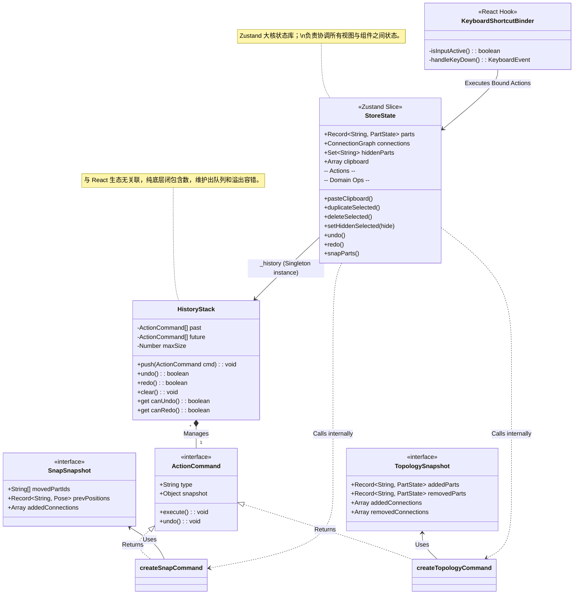

# LDraw Web CAD核心交互类图文档 (Class Diagram)

呈现 `historyStack` 的抽象基石和 `store` 基于接口的业务化隔离。它摒弃了强耦合设计，确保内存历史池为无依赖的纯数据函数闭包。

```mermaid
classDiagram
    %% ======= 基础接口区 =======
    class ActionCommand {
        <<interface>>
        +String type
        +Object snapshot
        +execute() : void
        +undo() : void
    }

    class SnapSnapshot {
        <<interface>>
        +String[] movedPartIds
        +Record~String, Pose~ prevPositions
        +Array addedConnections
    }

    class TopologySnapshot {
        <<interface>>
        +Record~String, PartState~ addedParts
        +Record~String, PartState~ removedParts
        +Array addedConnections
        +Array removedConnections
    }

    %% ======= 实现定义区 =======
    class HistoryStack {
        -ActionCommand[] past
        -ActionCommand[] future
        -Number maxSize
        +push(ActionCommand cmd) : void
        +undo() : boolean
        +redo() : boolean
        +clear() : void
        +get canUndo() : boolean
        +get canRedo() : boolean
    }

    class StoreState {
        <<Zustand Slice>>
        +Record~String, PartState~ parts
        +ConnectionGraph connections
        +Set~String~ hiddenParts
        +Array clipboard
        -- Actions --
        +pasteClipboard()
        +duplicateSelected()
        +deleteSelected()
        +setHiddenSelected(hide)
        +undo()
        +redo()
        -- Domain Ops --
        +snapParts()
    }

    class KeyboardShortcutBinder {
        <<React Hook>>
        -isInputActive() : boolean
        -handleKeyDown() : KeyboardEvent
    }

    %% ======= 继承与关联域 =======
    ActionCommand <|.. createSnapCommand : Returns
    ActionCommand <|.. createTopologyCommand : Returns
    
    SnapSnapshot <-- createSnapCommand : Uses
    TopologySnapshot <-- createTopologyCommand : Uses

    HistoryStack "*" *-- "1" ActionCommand : Manages 

    StoreState --> HistoryStack : _history (Singleton instance)
    StoreState ..> createSnapCommand : Calls internally
    StoreState ..> createTopologyCommand : Calls internally
    
    KeyboardShortcutBinder --> StoreState : Executes Bound Actions

    %% 业务关联注释
    note for StoreState "Zustand 大核状态库；\n负责协调所有视图与组件之间状态。"
    note for HistoryStack "与 React 生态无关联，纯底层闭包含数，维护出队列和溢出容错。"
```
