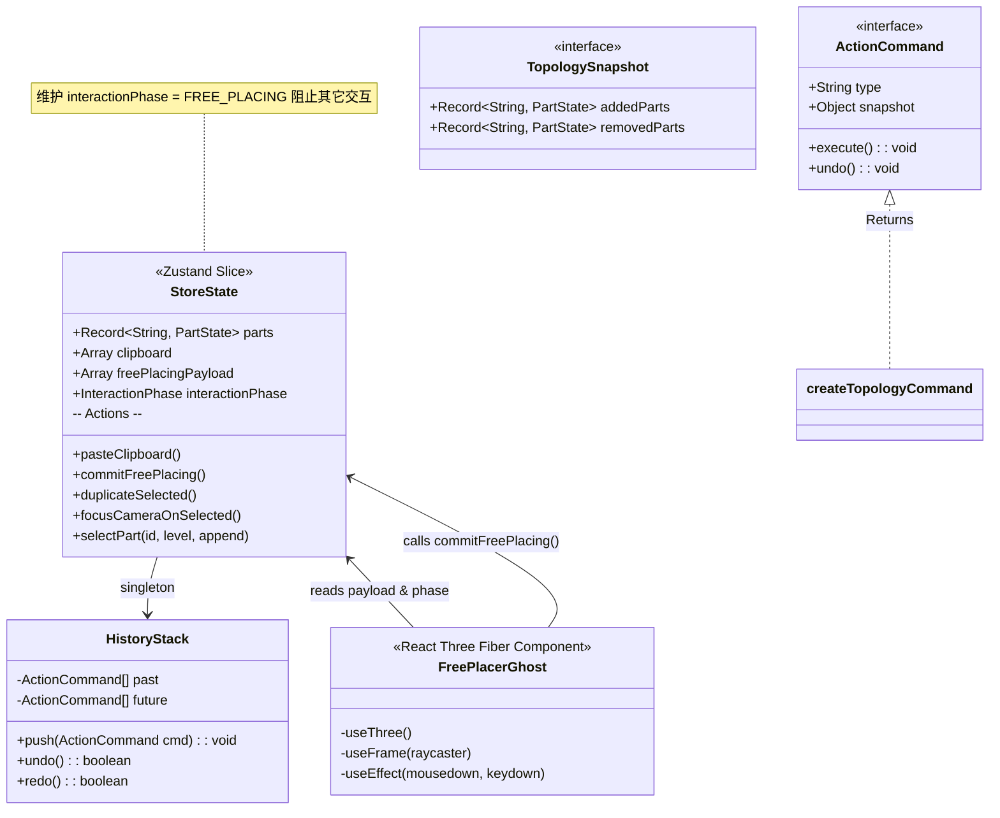

# LDraw Web CAD核心交互类图文档 (Class Diagram)

包含 v1.3 版本新增的 `FREE_PLACING` 幽灵状态流。

```mermaid
classDiagram
    %% ======= 基础接口区 =======
    class ActionCommand {
        <<interface>>
        +String type
        +Object snapshot
        +execute() : void
        +undo() : void
    }

    class TopologySnapshot {
        <<interface>>
        +Record~String, PartState~ addedParts
        +Record~String, PartState~ removedParts
    }

    %% ======= 实现定义区 =======
    class HistoryStack {
        -ActionCommand[] past
        -ActionCommand[] future
        +push(ActionCommand cmd) : void
        +undo() : boolean
        +redo() : boolean
    }

    class StoreState {
        <<Zustand Slice>>
        +Record~String, PartState~ parts
        +Array clipboard
        +Array freePlacingPayload
        +InteractionPhase interactionPhase
        -- Actions --
        +pasteClipboard()
        +commitFreePlacing()
        +duplicateSelected()
        +focusCameraOnSelected()
        +selectPart(id, level, append)
    }

    class FreePlacerGhost {
        <<React Three Fiber Component>>
        -useThree()
        -useFrame(raycaster)
        -useEffect(mousedown, keydown)
    }

    %% ======= 关联域 =======
    ActionCommand <|.. createTopologyCommand : Returns
    StoreState --> HistoryStack : singleton
    StoreState <-- FreePlacerGhost : reads payload & phase
    StoreState <-- FreePlacerGhost : calls commitFreePlacing()

    note for StoreState "维护 interactionPhase = FREE_PLACING 阻止其它交互"
```
