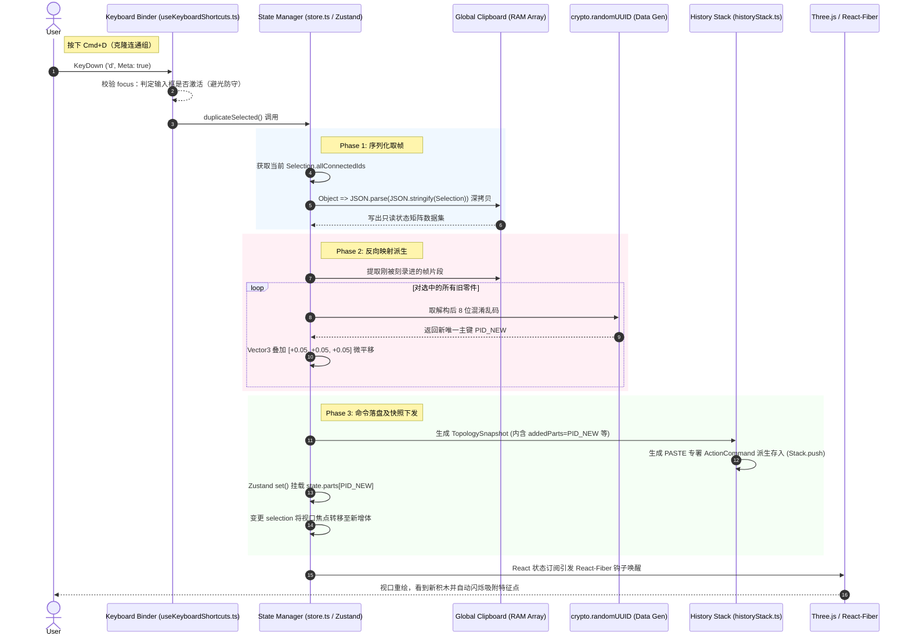

# LDraw Web CAD 数据流链路设计 (Data Flow)

本篇解构在执行一次带撤销能力的克隆操作时，系统底层的数据运转环及影响面。

## 撤销状态反向补偿流 (Undo Data Reversion)

当用户在上述结束后点击撤回（`Cmd+Z`）：

1.  **总线引流**：`Keyboard` 总线转手进入 `Store.undo()`
2.  **出栈决策**：`HistoryStack` 从顶端弹出上文打包的 `PASTE` TopologyCommand
3.  **负熵回归**：命令的 `revertFn` 拿到其私有快照，并指派 Store 从大盘中切除并 `delete np[PID_NEW]`
4.  **下沉未来**：该 Command 自我压入 `future` 并清零 selection
5.  **图元蒸发**：引擎由于无零件供应，新零件自动从 `Scene.jsx` 的渲染树中下线消失。
